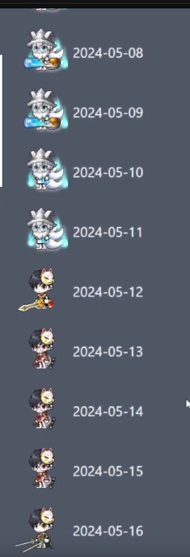

# MapleStory Character Scraper and Frontend

This is a fun project I have worked on for the community in the game called MapleStory. It features a fully automated process which pulls daily snapshots of character image data and serves them through a web application frontend.

The frontend is entirely static and no servers were provisioned for this. It took a while to figure out how to do this, but I was glad to be able to dynamically reference new images from the static web application without needing to perform any re-deployments.

The backend automation consists of an AWS Lambda that performs the tasks of scraping the character website, reading the image data, and then uploading the images to S3. This is run once daily, scheduled through EventBridge.

All infrastructure is provisioned through Terraform.

## Components

### 1. Backend Web Scraper (`\Character.WebScraper`)

This folder contains the C# Lambda function that pulls character image data from the website and uploads the images to S3.

### 2. Frontend Web Application (`\WebApp`)

This is the React-based web application that displays MapleStory character images for a select number of characters. This web application frontend allows users to browse through a directory of characters and view their images by month.

### 3. Infrastructure as Code (`\Terraform`)

This folder contains the Terraform code to create the resources on AWS. It sets up the infrastructure required to run the Lambda function on a scheduled basis and deploy the static website on AWS S3 - served through CloudFront.

## Screenshots

## Technologies

- C# / .NET
- React.js
- JavaScript
- Terraform
- AWS Lambda, S3, EventBridge, CloudFront, Route53
